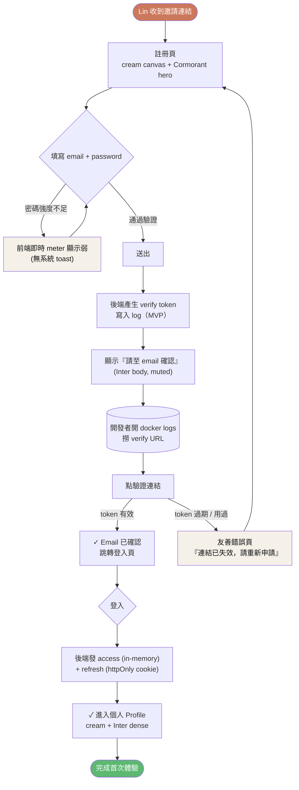
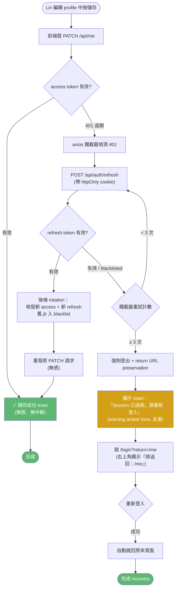
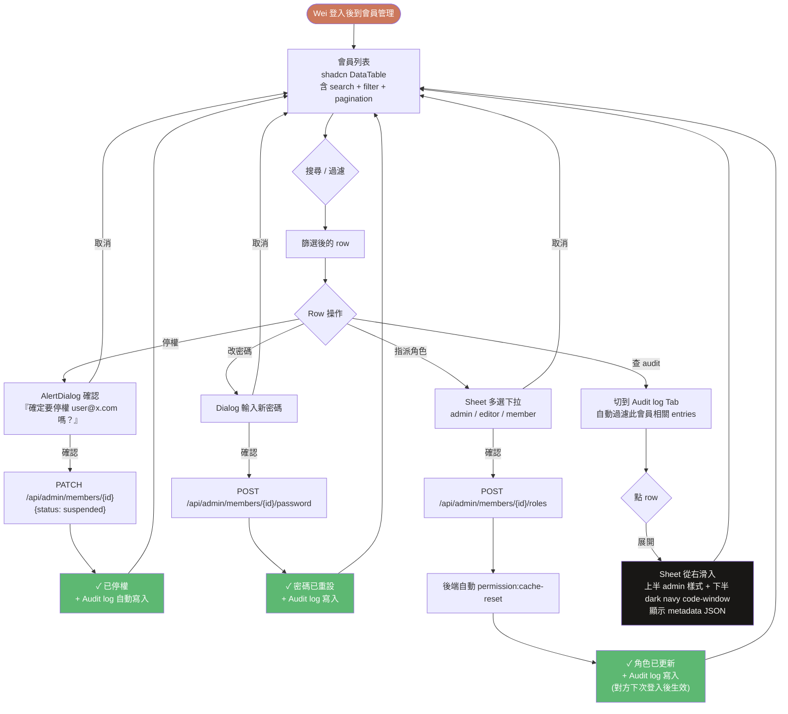

---
stepsCompleted:
  - step-01-init
  - step-02-discovery
  - step-03-core-experience
  - step-04-emotional-response
  - step-05-inspiration
  - step-06-design-system
  - step-07-defining-experience
  - step-08-visual-foundation
  - step-09-design-directions
  - step-10-user-journeys
  - step-11-component-strategy
  - step-12-ux-patterns
  - step-13-responsive-accessibility
  - step-14-complete
status: complete
lastStep: 14
designDirection: 'B - shadcn 結構 + Anthropic token 疊用'
inputDocuments:
  - _bmad-output/planning-artifacts/product-brief-bmad-project.md
  - _bmad-output/planning-artifacts/product-brief-bmad-project-distillate.md
  - _bmad-output/planning-artifacts/prd.md
  - _bmad-output/planning-artifacts/validation-report-2026-05-15.md
  - DESIGN.md  # Anthropic / Claude.com 品牌設計系統，作為視覺美學參考
project_name: bmad-project
user_name: Jie
date: '2026-05-15'
---

# UX Design Specification — bmad-project

**Author:** Jie
**Date:** 2026-05-15

---

<!-- UX design content will be appended sequentially through collaborative workflow steps -->

## Design Direction（Step 1 確認）

**方向**：**B — shadcn 結構 + Anthropic 設計 token 疊用**

### 保留（不變更 PRD 既有決策）

- **元件結構與行為**：shadcn/ui（Radix 無障礙底）為元件基底
- **Admin layout 起點**：抄 `satnaing/shadcn-admin` layout pattern
- **元件清單**：Form / Table / Dialog / Sheet / Command / Sidebar / Tabs 等 shadcn 元件，行為與互動保持原樣

### 疊用 Anthropic 設計 token（替換 shadcn 預設黑白）

#### Color Tokens（取自 DESIGN.md）

| Token | Value | 用途（admin 對映）|
|---|---|---|
| `--background` / canvas | `#faf9f5`（cream）| 全站背景 |
| `--card` / surface-card | `#efe9de` | Card / Sidebar 背景 |
| `--surface-soft` | `#f5f0e8` | Section divider / muted sections |
| `--surface-dark` | `#181715` | Code blocks / Audit log 區塊背景 / Login 頁等少數 dark surface |
| `--primary` / coral | `#cc785c` | 主 CTA（登入、儲存、確認、Submit）|
| `--primary-active` | `#a9583e` | press 狀態 |
| `--ring` / coral 15% alpha | `#cc785c` @ 15% | input focus ring（取代 shadcn 預設藍）|
| `--foreground` / ink | `#141413` | 主文字 |
| `--muted-foreground` | `#6c6a64` | 次文字、breadcrumb、metadata |
| `--border` / hairline | `#e6dfd8` | input / card 邊框 |
| `--accent-teal` | `#5db8a6` | 狀態指示（"active"、"online"、success dot）|
| `--accent-amber` | `#e8a55a` | 警告 badge |
| `--success` | `#5db872` | 成功 toast / status |
| `--warning` | `#d4a017` | 警告 toast |
| `--destructive` | `#c64545` | 刪除 / 停權 confirm 按鈕、error |

#### Typography Tokens

| 角色 | Font | 開源替代 | 用途 |
|---|---|---|---|
| Display（h1-h3） | Copernicus | **Cormorant Garamond** weight 500，letter-spacing -0.02em | Page title、Section heading、Login 頁 hero |
| Body / UI | StyreneB | **Inter** weight 400/500 | 所有 UI label、form、table、navigation |
| Code | JetBrains Mono | 同名（開源） | API 文件 try-it-out、jti 顯示、audit log payload |

**字級對映**（簡化 admin 用，從 DESIGN.md 取主要層級）：

- `display-md` 36px Cormorant 400 (-0.5px) → 頁面主標題、登入頁 hero
- `display-sm` 28px Cormorant 400 (-0.3px) → Card title、Dialog title
- `title-md` 18px Inter 500 → Form section title、Table header
- `title-sm` 16px Inter 500 → Sidebar item、Tab label
- `body-md` 16px Inter 400 → Form input、Table cell、description
- `body-sm` 14px Inter 400 → Helper text、Audit log entry
- `caption` 13px Inter 500 → Badge、status pill
- `caption-uppercase` 12px Inter 500 + 1.5px tracking → Section category、"NEW"
- `code` 14px JetBrains Mono → token / jti / API response 預覽

#### Radius & Spacing（保留 DESIGN.md 哲學）

- `rounded-md` 8px → Button / Input
- `rounded-lg` 12px → Card / Dialog
- `rounded-xl` 16px → Login 頁 hero illustration container
- `rounded-pill` → Badge / Status pill
- Spacing 沿用 DESIGN.md 的 4-base 系統（4 / 8 / 12 / 16 / 24 / 32 / 48 / 96px）

### 編輯式氣質的 admin 落地原則（從 DESIGN.md 「Do's」改編）

- **Cream canvas + 不用純白**：取代 shadcn 預設灰白；admin 仍能保有 Anthropic 辨識度
- **Coral 稀缺使用**：每頁 1–2 個主 CTA 為 coral；列表 row action（編輯 / 刪除）不上色
- **Serif 用於 Display，sans 用於 UI**：admin 內 form / table / button 全是 Inter；只有 page title 與 Login 頁 hero 用 Cormorant Garamond
- **Dark surface 點綴使用**：Login 頁右側 illustration container、Audit log 的 detail panel、API 文件 code block 用 dark navy；其餘 admin 主體保持 cream
- **無 hover 過度設計**：press 狀態 darken，hover 維持原樣（符合 DESIGN.md 「Don't add hover state styling」）

### 實作落點（PRD frontend stack 對映）

- `tailwind.config.ts` 的 `theme.extend.colors` 與 `theme.extend.fontFamily` 寫入上述 token
- `app/globals.css`（或 `src/styles/globals.css`）設 `--background`、`--primary` 等 CSS variable（shadcn theme 機制）
- 安裝 `@fontsource/cormorant-garamond` + `@fontsource/inter` + `@fontsource/jetbrains-mono`（自架字體，避免外部 CDN）
- shadcn 元件透過 CSS variable 自動套用 token，無需逐元件改

## Executive Summary

### Project Vision

從 UX 視角看，bmad-project 不是再一個「shadcn admin clone」，而是**結合 Anthropic 編輯式美學（cream canvas + coral CTA + Cormorant serif）與 shadcn admin 實用結構**的個人 side project 共同骨架。第一眼讓使用者（或 fork 起新專案的未來自己）感覺「這跟其他 admin 不一樣，有人花心思設計」，第二眼仍能找到熟悉的 shadcn 元件行為（表格、表單、命令面板、sidebar）做 admin 該做的事。

設計核心三件事：

1. **視覺辨識度**：cream `#faf9f5` + coral `#cc785c` + dark navy `#181715` 取代 shadcn 預設黑白，避免「又是一個 admin 模板」的觀感。
2. **資料密度與編輯氣質的平衡**：admin 需要密集表格與表單，DESIGN.md 是 marketing 取向；我們只在 page title / Login 頁 hero / Card title 用 Cormorant serif，所有 UI（form / table / button）保留 Inter 確保可讀性與資料密度。
3. **角色差異化的選單與導航**：admin / editor / member 看到不同 sidebar，UI 必須讓「我現在是什麼角色」這件事一眼可辨（不只是隱藏項目）。

### Target Users

依 PRD User Journeys 既定的四類角色：

- **Member（會員端使用者）**：persona「Lin」——一般使用者，被邀請或自己註冊。最常用功能：登入、Profile 編輯、密碼變更。期待 token 機制完全無感（J2 的核心承諾）。**裝置**：行動裝置為主、筆電為輔。
- **Editor（中間權限角色）**：未來業務 fork 時的「能改但不能刪會員」角色。MVP 階段選單比 admin 少幾項，主要是「可以管理某類業務資料但無法管會員與角色」的示範。**裝置**：筆電為主。
- **Admin（管理員）**：persona「Wei」——seeder 建出來的初始 admin。最常用功能：會員列表 search/pagination/sort、停權、改密碼、指派角色、查 Audit log。**裝置**：筆電為主。
- **Developer / Fork User（半年後的我）**：persona「未來的 Jie」——`git clone` + `bin/new-project.sh` 起新專案。第一眼看到的不是 admin UI 而是 CLI 互動式問答、README quickstart、`docker compose up` 的終端輸出。**裝置**：終端機 + 編輯器。

### Key Design Challenges

1. **編輯式美學 × admin 資料密度的衝突**——DESIGN.md 的 96px section padding、generous internal padding 適合 marketing，admin 表格需要更密。**策略**：Anthropic token 只套用色彩 / typography / radius；spacing 在 admin 內部採 shadcn 預設較緊湊的標準（12–24px 為主，96px 只用於 Login / 空狀態 / 404 頁這類「敘事性」頁面）。
2. **三角色選單差異化的視覺呈現**——隱藏項目是基本盤，更進階的是讓「身分」本身可見。**策略**：sidebar 頂端用 badge-pill 顯示當前角色（`badge-coral` for admin / `badge-pill` cream for editor / muted for member），讓使用者隨時知道自己「以什麼身分操作」。
3. **JWT 失敗路徑的 UX（J2 edge case）**——refresh token 過期、token chain 異常時要強制登出並保留 return URL。**策略**：用 shadcn `<Toast>` 顯示「Session 已過期，請重新登入」+ 自動跳轉，登入頁右上角顯示「將返回：{return URL}」micro-copy。
4. **Audit log 的 dense 顯示**——actor / action / target / timestamp / metadata，每筆 metadata 可能是 JSON payload。**策略**：表格顯示前 4 欄；點某筆 row 展開 detail panel，metadata 用 dark navy `code-window-card` + JetBrains Mono 顯示，呼應 DESIGN.md「dark navy product chrome」哲學。
5. **`bin/new-project.sh` 的 CLI UX**——常被忽略但 J4 的核心體驗。**策略**：互動式 prompt 用清楚的 progress 指示（`[1/5] Project name?` 形式）+ confirmation summary 顯示「將修改以下檔案」+ dry-run mode 預設先預覽。

### Design Opportunities

1. **Login 頁作為「打開 repo 第一眼」的招牌**——cream canvas + Cormorant Garamond hero「Welcome back」+ 左側 form 右側 dark navy illustration container（simple coral + navy line-art on cream），fork 起新專案的使用者第一眼就 wow。差異化於 99% admin starter kit 預設「藍底 logo + 中央 form」的無聊登入。
2. **Empty state 用 Anthropic 風格 line-art**——「沒有會員」「Audit log 為空」等空狀態用 simple coral + dark-navy line-art on cream，避免 lucide icon 大圖示的通用感。
3. **API 文件頁面（Scribe）視覺整合**——Scribe 預設有自己的樣式，但可疊一層 Anthropic 色彩主題：cream background + dark navy code blocks + coral try-it-out button。讓「點開 `/api/docs` 也是同一個品牌」。
4. **角色切換體驗**（未來擴張）——若 admin 想預覽其他角色看到的介面，可加「View as Member / Editor」浮動切換。MVP 階段先不做，但 sidebar 角色 badge 的設計要為未來可擴張。
5. **`bin/new-project.sh` 終止畫面**——成功 fork 後輸出「✓ Ready in 70 minutes」+ ASCII art logo + 下一步建議（`cd && docker compose up`），把 CLI 體驗做成可截圖的 hero moment。

## Core User Experience

### Defining Experience

本案 starter kit 的「核心體驗」非單一 user action，而是**兩個 critical 體驗**並列：

1. **「Fork to first business code」60–70 分鐘**（J4 — Developer / 半年後的我）
   - `git clone` → `bin/new-project.sh` 互動式問答（namespace / port / DB / git remote）→ 自動改檔 → `docker compose up` → seeders 自動跑 → admin 可登入 → 開始寫第一個 business controller
   - **這是 starter kit 的真正 product surface**——admin / 會員端 UI 是「展示」的副產品，fork 體驗才是賣點本身

2. **「Open to authenticated admin」60 秒**（J3 climax）
   - 首次跑起來時，使用者打開瀏覽器 → cream canvas + Cormorant「Welcome back」hero → 用 seeder 建出的 admin 帳號登入 → 看到角色 badge + 三角色差異化 sidebar → 開始操作會員管理
   - 這是「fork 後第一次有 UI 反饋」的 wow moment，視覺辨識度（DESIGN.md 美學）就是要在這個瞬間被記住

### Platform Strategy

| Platform | 對象 | 範圍 | 設計重心 |
|---|---|---|---|
| **Browser（admin web）** | Admin、Editor | 筆電 ≥ 1280px 為主、平板可用 | 資料密度、表單、表格、角色差異化 sidebar |
| **Browser（會員端 web）** | Member | 手機 ≥ 375px + 筆電 | 輕量化、響應式優先、token 攔截器無感 UX |
| **CLI（終端機）** | Developer | macOS / Linux / WSL2（Windows 需 WSL2，PRD Major Risk #2） | `bin/new-project.sh` 互動式 prompt、`docker compose up` 終端輸出、ASCII art 結束畫面 |
| **Browser（API 文件）** | Developer 自己 + 未來 fork 後的 API consumer | 筆電 | Scribe 文件疊 Anthropic 色彩主題、JWT bearer try-it-out 流暢 |

**離線**：不適用（純本機 docker 已是「離線」狀態；MVP 不考慮 PWA 或離線 sync）。
**Native features**：不適用（無相機 / GPS / push 等需求）。

### Effortless Interactions（應該無感的）

1. **JWT token refresh**——access token 過期時前端 axios 攔截器自動 refresh + 重發原請求；使用者完全察覺不到（J2 核心）。
2. **Spatie permission cache invalidation**——admin 改某會員角色後，背景自動 `permission:cache-reset`；admin 不需要任何手動動作。
3. **Docker entrypoint seeders auto-run**——首次 `docker compose up` 時 entrypoint 自動跑 seeders，admin 帳號直接可用；使用者不需要記得跑 `php artisan db:seed`。
4. **Form 即時驗證**——password 強度（前端即時 meter）、email format（onBlur）、密碼一致性比對（onChange）——不等到 submit 才報錯。
5. **`bin/new-project.sh` 自動偵測衝突**——若指定的 port 已被佔用，提示替代 port；若 namespace 已存在於 `composer.json`，提示重命名——使用者不會 silently 撞牆。
6. **登入後 return URL 復原**——token chain 異常或 session 過期被踢出登入頁時，登入成功後自動回到原來操作的頁面（不是首頁）。

### Critical Success Moments

| Moment | 描述 | UX 設計重心 |
|---|---|---|
| **首次 docker compose up 成功** | 終端輸出顯示 seeders 完成 + ASCII banner「✓ bmad-project ready at http://localhost:8080」+ 預設 admin 帳號資訊 | 終端輸出格式化、顏色標示、清楚的「下一步」指引 |
| **首次 admin 登入** | cream + Cormorant hero → 輸入帳號 → 看到 sidebar role badge `[Admin]` coral + 會員列表 | Login 頁敘事性視覺、sidebar 第一眼就有 hierarchy |
| **Token refresh 無感體驗** | 編輯 profile 中途 access token 過期，按儲存 → 完全沒中斷 → 儲存成功 toast | axios 攔截器 + return URL preservation + 失敗 fallback 設計 |
| **Token 失敗的優雅降級** | refresh token 也死了 → toast「Session 已過期」+ 自動跳 login + return URL 註記 | toast 文案、跳轉時機（不要太快讓人看不到提示）、return URL micro-copy |
| **`bin/new-project.sh` 完成** | 70 分鐘後輸出「✓ Ready! cd my-tool && docker compose up」+ ASCII art + ADR 提醒「之前的決策保留在 docs/decisions/」 | 終端輸出可截圖、有 hero moment、清楚的下一步 |
| **API 文件 try-it-out 成功** | Scribe 頁面點 try-it-out → 自動帶入 JWT bearer → 看到真實回應 | Scribe 主題化、JWT 自動填入、回應格式化顯示 |
| **Audit log 詳情展開** | Admin 點某筆 row → 側邊或下方展開 detail panel → dark navy code-window 顯示 metadata JSON | dark navy code block 樣式、JetBrains Mono、行號、syntax highlight |

### Experience Principles

1. **「開箱即用」（Zero Manual Setup）**
   `docker compose up` 60 秒內到可登入 admin，沒有「請手動跑 migration / 手動建 admin / 手動設環境變數」的斷層。Seeders auto-run + `.env.example` 預設值合理 + entrypoint script 處理所有初始化。

2. **「無感勝於提示」（Invisible When Working, Visible When Failing）**
   Token refresh、cache invalidation、auto-save 等「正常運作」的事完全沉默；只在**失敗或需要使用者決策**時才浮現 UI（toast、dialog、confirm）。減少 UI noise。

3. **「敘事性 vs. 工作性介面分離」（Editorial vs. Operational Modes）**
   - **敘事性介面**（Login / 404 / Empty state / `bin/new-project.sh` 終止畫面 / Onboarding）→ DESIGN.md 完整套用：Cormorant Garamond hero、cream canvas、coral CTA、generous padding（96px section）
   - **工作性介面**（admin 主體：列表、表單、表格、Audit log）→ Anthropic token 但 spacing 收緊（12–24px）、字體用 Inter、Cormorant 只用於 page title

4. **「角色身分隨時可見」（Identity Always Visible）**
   Sidebar 頂端永遠顯示當前角色 badge（admin = coral / editor = cream / member = muted），使用者隨時知道自己「以什麼權限操作」，不需點 profile 確認。為未來「View as Member / Editor」功能預留視覺位置。

5. **「視覺辨識度先於慣例」（Brand Identity Over Convention）**
   寧可用 cream + coral 違反 admin starter kit 普遍黑白慣例，也要在第一眼讓使用者記住「這個 starter kit 跟其他不一樣」。前提是 shadcn 元件行為與 a11y 保持不變——挑戰慣例的是視覺，不是互動模式。

## Desired Emotional Response

### Primary Emotional Goals

| 對象 | 主要情緒 | 觸發點 |
|---|---|---|
| **Developer Fork User** | **Confident & Empowered**（「我馬上能寫 business 了」） | `bin/new-project.sh` 70 分鐘完成、看到 ADR 留檔、admin 可登入 |
| **Admin** | **In Control**（「我清楚知道每個操作做了什麼」） | 角色 badge 永遠可見、Audit log dense 顯示、Confirm dialog 在敏感操作 |
| **Member** | **Calm & Trusted**（「這 app 不會掉我的資料」） | Token refresh 無感、改密碼後立即可用、Form 即時驗證 |
| **第一次打開 repo 的訪客** | **Inspired & Curious**（「這 starter kit 不一樣」） | Login 頁 Cormorant hero、cream + coral 色彩、Empty state line-art |

### Emotional Journey Mapping

| Stage | Member 情緒 | Admin 情緒 | Developer 情緒 |
|---|---|---|---|
| **Discovery / First Open** | Curious（被邀請進站） | Confident（seeder 給的帳號可用） | Inspired（git clone 後看到 README） |
| **Onboarding** | Trust building（註冊 + email 驗證流暢） | Comfort（首登就看到角色 badge） | Anticipation（執行 `bin/new-project.sh`） |
| **Core Action** | Effortless（profile 編輯無 friction） | Productive（會員管理 dense 但清楚） | Empowered（70 分鐘後可寫 business code） |
| **Completion** | Satisfied（看到「儲存成功」toast） | Accomplished（Audit log 確認操作已記錄） | Proud（看到 ASCII art「Ready!」） |
| **Failure Path** | **Reassured not panicked**（token 過期 → 友善 toast + return URL） | Informed（操作失敗有清楚 error 而非 generic 500） | Recoverable（new-project.sh dry-run 預覽 + 衝突提示） |
| **Return Visit** | Familiar（login 體驗一致） | Trusted（角色與權限沒變） | Reusable（fork 再起新專案一樣順） |

### Micro-Emotions（最關鍵的幾組對立）

| 要 | 避免 | 設計手段 |
|---|---|---|
| **Confidence** | Confusion | sidebar 永遠顯示當前角色 badge；breadcrumb 永遠顯示當前位置 |
| **Trust** | Skepticism | Audit log 完整透明、password 變更後 force re-login、token 撤銷有明確 toast |
| **Accomplishment** | Frustration | 7 個驗收場景每一個結束都有明確 success state（toast / 跳轉 / 視覺反饋） |
| **Delight** | Anxiety | Login 頁 Cormorant hero + dark navy illustration container 創造 wow；`bin/new-project.sh` ASCII art 結束畫面 |
| **Inspiration** | Generic | 拒絕 admin starter kit 黑白慣例；用 Anthropic 美學換取「這跟其他不一樣」的 first impression |
| **Calm** | Overwhelm | 編輯式氣質：Login / Empty / 404 頁用 generous padding 與 serif title，避免「資訊塞滿全螢幕」的 admin 觀感 |

### Design Implications

- **Confidence** → Sidebar role badge（coral / cream / muted 按角色）+ breadcrumb + 操作 confirm dialog 在 destructive 動作前
- **Trust** → Audit log 完整透明 + dark navy code-window 展示 metadata + token 撤銷時明確 toast
- **Effortless** → axios 攔截器靜默 refresh + form 即時驗證 + auto-save 草稿（未來擴張）+ docker seeders auto-run
- **Delight** → Login 頁 hero + cream canvas + Cormorant serif + 空狀態 line-art + CLI ASCII art
- **Calm** → 敘事頁面用 96px section spacing；toast 文案不嚴厲（「Session 已過期，請重新登入」而非「ERROR: Token Expired」）
- **Inspired** → Anthropic 色彩 token 全面套用；page title 用 Cormorant；Empty state 不用 lucide 大圖示

### Emotional Design Principles

1. **「Failure should feel like recovery, not punishment」**——所有失敗路徑（token 過期、表單驗證錯、Admin 操作衝突）都用 reassuring 而非 alarming 的文案與視覺。Toast 用 soft tone（cream / amber），保留 error 紅色給真正系統錯誤。

2. **「Confidence through visibility, not assurance」**——不靠「Don't worry, we got you」的文案建立信任，而是讓所有操作可見（Audit log 透明、role badge 永顯、改密碼後 force re-login 是 trust feature）。

3. **「Inspiration is the secret weapon for starter kit」**——一份 admin starter kit 通常被當作「能跑就好」的工具；但本案的視覺辨識度直接影響「fork 的人是否會留下來繼續用」。Login 頁與 Empty state 是 emotional hero moment，不能省。

4. **「Productivity feels like flow, not friction」**——admin 主體（list / form / audit）不上 serif 字體、不上 96px padding；保持 shadcn 預設的密度與節奏，讓「工作」感覺流暢而非裝飾。

## UX Pattern Analysis & Inspiration

### Inspiring Products Analysis

| 產品 | 適用於本案 | 學什麼 |
|---|---|---|
| **Claude.com / Anthropic 官網** | **視覺基底**（DESIGN.md 來源） | Cream canvas + coral + Cormorant serif；編輯式 hero pattern；dark navy product chrome；spike-mark 作為品牌 anchor；section pacing 哲學 |
| **Linear** | **互動模型** | `Cmd+K` command palette（quick action / quick nav）；keyboard-first 思維；dense issue list 仍可讀；status badge 用語義色彩 |
| **Vercel Dashboard** | **資料密度** | 黑白基底 + monospace 點綴；table row hover 不誇張；project list 卡片化；deployment status 用最小視覺 |
| **Stripe Dashboard** | **Admin 表單與表格** | Form inline validation；side detail panel pattern；audit / event timeline 表現方式；search + filter bar |
| **shadcn/ui + `satnaing/shadcn-admin`** | **元件基底** | shadcn 元件清單、Radix a11y 底；admin layout pattern（sidebar + topbar + main + tabs）；route guard 寫法 |
| **Scribe (knuckles.wtf) 官網** | **API 文件主題化參考** | 自動推導文件如何依然有品牌感；side nav + endpoint hierarchy |

### Transferable UX Patterns

#### Navigation Patterns

- **Sidebar with role badge top**（取自 Linear / Vercel + 本案原創）
  - 適用於本案：sidebar 頂端永遠顯示當前角色，三角色差異化選單
- **Command Palette（`Cmd+K`）**（取自 Linear）
  - 適用於本案：admin 高頻操作（找會員、查 audit、改角色、跳頁面）統一入口；shadcn `Command` 元件直接可用
- **Breadcrumb on detail pages**（取自 Stripe）
  - 適用於本案：會員 detail → audit log of this member 等多層導航

#### Interaction Patterns

- **Inline form validation**（取自 Stripe / Vercel）
  - 適用於本案：password 強度 meter、email format onBlur、確認密碼即時比對
- **Side detail panel on row click**（取自 Stripe events / Linear issues）
  - 適用於本案：Audit log row click → 右側展開 dark navy code-window 顯示 metadata JSON
- **Optimistic UI for known-safe operations**（取自 Linear status toggle）
  - 適用於本案：profile 改名、角色 toggle 等可先樂觀更新 UI，背景 API 完成
- **Confirm dialog for destructive operations**（取自 Stripe）
  - 適用於本案：停權 / 刪除帳號 / 改密碼這類 confirm dialog（shadcn `AlertDialog`）

#### Visual Patterns

- **Editorial hero on non-admin pages**（取自 Claude.com）
  - 適用於本案：Login / 404 / Empty state / Onboarding——cream canvas + Cormorant hero + line-art
- **Dark navy code-window in admin**（取自 Claude.com 產品截圖）
  - 適用於本案：Audit log detail / Scribe try-it-out response / 任何 JSON / token / payload 顯示
- **Soft hairline border, no shadow**（取自 Claude.com）
  - 適用於本案：所有 card / input / button 用 1px hairline `#e6dfd8`，避免 admin starter kit 常見的 shadow-heavy 設計

### Anti-Patterns to Avoid

- ❌ **每個 row hover 都閃 coral 或變色**——coral 是稀缺信號（CTA only）；行 hover 用最小視覺（`#f5f0e8` soft 背景）
- ❌ **嚴厲 error 文案**（「FAILED」「INVALID INPUT」「ERROR 401」）——本案 emotional principle「Failure feels like recovery」；改用「請重新登入」「密碼長度不足」「Session 已過期」等 reassuring tone
- ❌ **強制 Modal 中斷 flow**——除非真的需要 confirm；非破壞性操作用 inline 編輯或 side panel
- ❌ **Lucide 大圖示 Empty state**（「沒有資料 + 大灰色 icon」）——改用 Anthropic 風格 line-art coral + dark navy strokes on cream
- ❌ **預設藍色 button**——破壞 cream + coral 哲學；shadcn 預設 `bg-primary` 必須改 token 為 coral
- ❌ **Tailwind blue/green/red 直接套用**——保留 token 語意；用 `--success` `--warning` `--destructive` CSS variable
- ❌ **過長 form 不分區**——超過 5 個 field 就用 `Tabs` 或 `Accordion` 分區，或拆成 wizard
- ❌ **Sticky header 蓋住資料**——admin 表格上方的 search / filter 不固定，捲到下方時讓位給資料
- ❌ **Dark mode 強制 toggle 在主選單**——dark mode 是個人偏好，放在 profile 設定即可，不是 sidebar 主選項

### Design Inspiration Strategy

#### What to Adopt（直接套用）

- **Anthropic 色彩與 typography token 全套**（自 DESIGN.md / Claude.com）——cream / coral / Cormorant / dark navy
- **shadcn/ui 全部元件**（自 `satnaing/shadcn-admin`）——Form / Table / Dialog / Sheet / Command / Sidebar / Tabs / Toast / Alert / Avatar / Badge
- **Linear `Cmd+K` command palette**（shadcn `Command` + `Dialog` 組合）
- **Stripe 風格 side detail panel**（shadcn `Sheet` 從右滑入）
- **Vercel dense table** mode（hairline border + 最小行 hover）

#### What to Adapt（修改後使用）

- **Editorial hero pattern**（Claude.com 上是 marketing landing）——本案適用 Login / 404 / Empty / Onboarding 等敘事頁面，admin 主體不適用
- **Stripe events timeline**——本案 Audit log 採類似 timeline 視覺，但加 search + filter + JSON detail panel
- **shadcn admin sidebar collapsing**（`satnaing` 版預設不顯角色）——本案在 sidebar 頂端加 role badge
- **Anthropic 線稿插畫**（marketing 用 hero illustration）——本案用於 Empty state，畫風維持 coral + navy strokes on cream 但主題切換到「沒有會員」「沒有 audit log」等場景

#### What to Avoid

- **Marketing 取向的 96px section padding 在 admin 主體** —— admin 是工作介面，padding 收緊到 16–24px
- **Claude.com 的 hero illustration card 用在 admin list / form 頁** —— 不適用，admin 不需要插畫
- **Linear keyboard-only 設計**——本案需顧及 mouse 使用者，鍵盤捷徑是 enhancement 不是強制
- **Stripe / Vercel 的純黑白底色**——本案明確選 Anthropic cream，不該為了「看起來像 Stripe」改回白底

## Design System Foundation

### Design System Choice

**Hybrid：shadcn/ui（結構與行為）+ Anthropic Design Tokens（視覺）**——屬 themeable system 路線。

- **元件基底**：`shadcn/ui` v latest（Radix UI primitives + Tailwind CSS）
- **Admin layout 起點**：抄 `satnaing/shadcn-admin` 的 sidebar + topbar + main + tabs 結構
- **視覺 token**：取自 DESIGN.md（Claude.com / Anthropic 品牌設計系統）—— cream canvas + coral primary + dark navy + Cormorant + Inter + JetBrains Mono
- **CSS variable** 透過 shadcn 的 theme mechanism 注入，shadcn 元件自動套用
- **無需 fork shadcn**——只改 CSS variable 與 Tailwind config，shadcn 本體保持 upstream 可更新

### Rationale for Selection

| 評估維度 | 選擇 |
|---|---|
| 速度（速成 vs 獨特） | **平衡偏速**——shadcn 提供成熟元件，token override 只改視覺 |
| 元件品質 | 高（Radix a11y、活躍社群、TypeScript 完整、新元件持續加入） |
| 可客製化 | 高（copy-paste 擁有原始碼、CSS variable 機制） |
| Bundle 大小 | 低（只 ship 用到的元件，無 runtime 全套元件成本） |
| 文件與社群 | 強（shadcn 是 2026 admin dashboard 事實標準） |
| 適合 starter kit | 強（容易 fork、容易刪不需要的元件） |
| 視覺辨識度 | **靠 token override 達成**——Anthropic cream + coral 直接讓 starter kit 不像「另一個 shadcn admin」 |
| 與 PRD 一致 | 完全一致（PRD 已明確指定 shadcn）|

### Implementation Approach

#### CSS Variables（`src/styles/globals.css`）

```css
@layer base {
  :root {
    /* Anthropic cream surfaces */
    --background: 48 33% 97%;          /* #faf9f5 — canvas */
    --foreground: 60 3% 8%;            /* #141413 — ink */
    --card: 39 26% 90%;                /* #efe9de — surface-card */
    --card-foreground: 60 3% 8%;
    --popover: 48 33% 97%;
    --popover-foreground: 60 3% 8%;

    /* Coral primary */
    --primary: 17 51% 58%;             /* #cc785c */
    --primary-foreground: 0 0% 100%;

    /* Cream + muted */
    --secondary: 36 23% 85%;           /* #e6dfd8 — hairline / primary-disabled */
    --secondary-foreground: 60 3% 8%;
    --muted: 36 21% 89%;               /* #ebe6df — hairline-soft */
    --muted-foreground: 39 5% 41%;     /* #6c6a64 — muted */

    /* Accent / Semantic */
    --accent: 17 51% 58%;              /* coral 同 primary 在 admin 用途 */
    --accent-foreground: 0 0% 100%;
    --destructive: 0 50% 53%;          /* #c64545 */
    --destructive-foreground: 0 0% 100%;
    --success: 130 35% 54%;            /* #5db872 */
    --warning: 42 79% 47%;             /* #d4a017 */

    --border: 36 23% 87%;              /* #e6dfd8 hairline */
    --input: 36 23% 87%;
    --ring: 17 51% 58%;                /* coral focus ring */

    --radius: 0.5rem;                  /* 8px — DESIGN.md rounded.md */
  }

  /* Dark mode（為 Audit log detail panel / Code block / Login illustration container 使用） */
  .dark, [data-mode="dark-surface"] {
    --background: 30 7% 9%;            /* #181715 surface-dark */
    --foreground: 48 33% 97%;          /* #faf9f5 on-dark */
    --card: 30 6% 13%;                 /* #252320 surface-dark-elevated */
    /* ⋯⋯ */
  }
}
```

注意：本案**不採全站 dark mode toggle**——dark surface 只用於「敘事性 dark」場景（Audit log code-window、Login illustration container、Scribe code block）；admin 主體永遠 cream。

#### Tailwind 字型設定（`tailwind.config.ts`）

```ts
fontFamily: {
  display: ['"Cormorant Garamond"', 'Garamond', 'serif'],
  sans: ['Inter', '-apple-system', 'BlinkMacSystemFont', 'sans-serif'],
  mono: ['"JetBrains Mono"', 'ui-monospace', 'monospace'],
}
```

#### 字體載入

採 self-hosted via `@fontsource`（避免 CDN 與 GDPR 議題、確保 dev / offline 都能跑）：

```bash
pnpm add @fontsource/cormorant-garamond @fontsource/inter @fontsource/jetbrains-mono
```

`src/main.tsx` 引入：

```ts
import '@fontsource/cormorant-garamond/500.css'
import '@fontsource/inter/400.css'
import '@fontsource/inter/500.css'
import '@fontsource/jetbrains-mono/400.css'
```

### Customization Strategy

#### Override 層級

1. **CSS variable 層**（最常用）—— 改 `--primary`, `--background` 等變數，shadcn 元件自動套用
2. **Component variant 層**——當 shadcn 元件不夠用時，用 `cva` 加 variant（例如 `Button` 加 `editorial` variant 用 Cormorant serif + 大 padding 供 Login hero 使用）
3. **Slot override 層**（罕用）——重寫 component primitives，本案應該無需此層

#### 預期需 variant 的元件

| 元件 | 標準 variant | 新增 variant | 用途 |
|---|---|---|---|
| `Button` | default / destructive / outline / ghost / link | `editorial`（Cormorant serif、大 padding） | Login「Sign in」hero button |
| `Card` | default | `dark-surface`、`editorial-hero` | Audit log detail / Login illustration container / Empty state |
| `Badge` | default / secondary / destructive / outline | `role-admin`（coral）、`role-editor`（cream）、`role-member`（muted） | Sidebar role badge |
| `Empty`（自製） | — | `line-art`（含 SVG illustration slot） | 沒會員 / 沒 audit log / 沒搜尋結果 |
| `Heading`（自製） | — | `display-md / display-sm / title-md / title-sm`（對應 DESIGN.md typography 層級） | Page title / Card title / Section heading |

#### 不需要的 shadcn 元件（MVP 階段不裝）

- `Calendar` / `DatePicker`（MVP 無日期欄位需求；audit log 用簡單 timestamp display 即可）
- `Carousel`（admin 不需要輪播）
- `Drawer`（mobile only；本案 admin 桌面為主，會員端用 Sheet 即可）

#### 需要的 shadcn 元件（MVP 必裝）

`Form` / `Input` / `Button` / `Label` / `Card` / `Table` / `DataTable`（自製 wrapper） / `Sidebar` / `Tabs` / `Sheet` / `Dialog` / `AlertDialog` / `Toast` (Sonner) / `Badge` / `Avatar` / `Skeleton` / `Command` / `Popover` / `DropdownMenu` / `Select` / `Checkbox` / `Switch` / `Pagination` / `Tooltip`

## Defining Experience（Core User Experience 深入）

### Defining Experience

**`bin/new-project.sh` Fork Flow**——「Tinder 是 swipe to match；本 starter kit 是 **clone-then-script-to-business**」。

完整 flow（敘述版）：

```
$ git clone bmad-project-starter my-rss-tool
$ cd my-rss-tool
$ bin/new-project.sh

      ╭─────────────────────────────────────────────╮
      │  bmad-project starter kit                   │
      │  Fork this project for your next side proj  │
      ╰─────────────────────────────────────────────╯

[1/6] Project name? (e.g., my-rss-tool, used in README and metadata)
      > rss-curator

[2/6] PHP namespace? (e.g., RssCurator)
      > RssCurator

[3/6] HTTP port? (current: 8080, suggest 8081 if conflict)
      > 8081

[4/6] PostgreSQL database name?
      > rss_curator

[5/6] Keep example Member domain? (Y/n)
      > n

[6/6] Git remote (leave empty to skip)? > https://github.com/jie/rss-curator.git

      Dry-run summary:
      ─────────────────────────────────────
      project name        : rss-curator
      namespace           : App\ → RssCurator\
      port                : 8080 → 8081
      DB                  : bmad → rss_curator
      example Member      : remove
      git remote          : update to rss-curator.git

      Files to be changed:
        docker-compose.yml
        composer.json
        bootstrap/app.php
        .env.example
        package.json
        ... (12 files total)

      Proceed? (Y/n) > Y

      ✓ Applied changes (3.2s)
      ✓ Reinitialized git (kept full history? N — fresh history)
      ✓ Pushed to https://github.com/jie/rss-curator.git

      ╭─────────────────────────────────────────────╮
      │  ✓ Ready in 4 min                            │
      │                                              │
      │  Next:                                       │
      │    docker compose up      # ~3 min to seed   │
      │    open http://localhost:8081/admin          │
      │    log in with admin@example.com / password  │
      │                                              │
      │  Read the ADRs:                              │
      │    docs/decisions/                           │
      ╰─────────────────────────────────────────────╯
```

### User Mental Model

| 使用者期望 | 為何如此期望 |
|---|---|
| 互動式提問順序遵循「**重要的先問**」 | 與 `npm init` / `cargo new` / Laravel installer 等慣例一致 |
| 預設值都合理（可直接 Enter 跳過） | 與 Rails generator / Vite create 一致 |
| 看得到「改了哪些檔案」**才** 動手 | 開發者習慣先看 git diff 才 commit；dry-run 預覽是 trust 建立 |
| 失敗可 rollback / 重跑 | `bin/new-project.sh` 冪等性（PRD FR32）是核心承諾；不該讓使用者怕跑壞 |
| 結束後告訴我「下一步」 | 與 `npm create` 結束畫面類似——說「what's next」 |

### Success Criteria

- **Wall-clock time**：互動 + 確認 + 自動 apply ≤ 5 分鐘（剩餘 65 分鐘留給 `docker compose up` 拉 image / seed）
- **Confidence**：dry-run preview 讓使用者 100% 知道將改什麼；無 silent magic
- **Recoverability**：任何步驟可 Ctrl+C 中止；重跑時冪等（FR32）
- **Smart defaults**：80% 的答案可直接 Enter（namespace 從 project name 推導、DB 名同步、port 預設 8081 若 8080 佔用）
- **Failure visibility**：衝突明確提示（port 被佔用 → 提示替代；namespace 已存在 → 提示重命名）

### Novel vs. Established Patterns

**主要走 established pattern**（與 `npm create vite@latest`、`laravel new`、`bun create` 一致）：

- 互動式 prompt（已是 CLI 慣例）
- Dry-run summary + confirm（git interactive rebase / `terraform plan` 慣例）
- Final next steps（npm create 慣例）

**Novel twist**：

- **ADR 留存提醒**——結束畫面點出「docs/decisions/ 有當初的設計決策」，這在大部分 starter kit 沒看過。讓 fork 使用者知道「為何選 JWT 不選 Sanctum」這類決策有 written record
- **Editorial 結束畫面**——用 box drawing characters 把結束畫面包成一個「卡片」，視覺呼應 Anthropic editorial 美學（即使是 CLI）

### Experience Mechanics

#### Initiation（如何開始）

- **觸發**：使用者 `git clone <starter-url> <new-name> && cd <new-name> && bin/new-project.sh`
- **發現性**：README 第一段 quickstart 即提到 `bin/new-project.sh`；倉庫根目錄該腳本可執行
- **前置檢查**：腳本啟動時檢查 `git` `docker` `pnpm` 都在 PATH（缺則明確提示安裝）

#### Interaction（互動方式）

- **每題 prompt 顯示 `[N/6]` progress 標記**
- **每題可接受預設值**（顯示為 `> default-value` 灰色文字，按 Enter 接受）
- **每題顯示 helper text**（單行說明該值用途）
- **衝突偵測即時反饋**（port 8080 已被 docker / 其他 service 佔用 → 自動提示 8081）
- **可中斷**：Ctrl+C 任何時候安全退出，未 apply 前不改動檔案

#### Feedback（如何知道進行中）

- **每個答案 commit 後立即 echo 確認**（避免使用者懷疑「我答完它記下來了嗎」）
- **Dry-run summary 用對齊欄位排版**（左 key、中 arrow、右 value）
- **Files to be changed 列出檔名**（不展開內容，但讓使用者知道規模）
- **Apply 過程用 spinner + 完成 ✓ marker**
- **Git 操作獨立顯示**（git init / push 是高風險，明確分開不混在「改檔」內）

#### Completion（結束）

- **Box drawing 卡片結束畫面**——視覺辨識度
- **明確「Next:」三條指令**——`docker compose up`、瀏覽器 URL、預設帳密
- **「Read the ADRs」提示**——指向 `docs/decisions/`
- **Exit code 0**——無錯誤時純粹成功，使用者可串接到 CI / 自動化

#### Failure Path

- **驗證錯誤**（如 namespace 含非法字元）：當題重問，不重新跑全流程
- **衝突無法解**（如 port range 都被佔用）：顯示「請手動設定 port，然後重跑」+ exit code 1
- **Apply 階段中斷**：留下 `.new-project-state` 暫存檔，下次重跑可問「resume from last state? (Y/n)」
- **Git push 失敗**（remote 不存在）：警告但不阻擋；提示使用者手動 `git push -u origin main`

## Visual Design Foundation

Brand guidelines 來自 `DESIGN.md`（Anthropic / Claude.com）。本節聚焦 admin 場景對映、accessibility 與 implementation 細節。Token 對照表已在前面「Design Direction」段詳列，本節不重複。

### Color System

#### Semantic Mapping（admin 場景）

| 角色 | Token | 用途 |
|---|---|---|
| **Brand voltage** | `--primary` coral `#cc785c` | 主 CTA、Submit、Confirm；**每頁不超過 1–2 個** |
| **Page floor** | `--background` cream `#faf9f5` | 全站背景；admin / member 頁通用 |
| **Card / Sidebar** | `--card` `#efe9de` | Card / Sidebar / 表頭 background |
| **Section divider** | `--surface-soft` `#f5f0e8` | Card 內分區、Tab 容器底色 |
| **Dark surface** | `--surface-dark` `#181715` | Audit log code-window、Login illustration container、Scribe code block |
| **Hairline** | `--border` `#e6dfd8` | Card border、Input border、Table cell divider |
| **Text primary** | `--foreground` `#141413` | 主文字 |
| **Text body** | `body` `#3d3d3a` | 段落 |
| **Text muted** | `--muted-foreground` `#6c6a64` | Breadcrumb / metadata / helper text |
| **Status: success** | `--success` `#5db872` | 成功 toast、active dot |
| **Status: warning** | `--warning` `#d4a017` | warning toast、quota 接近上限 |
| **Status: destructive** | `--destructive` `#c64545` | error toast、停權 confirm 按鈕、validation error |
| **Status: info（teal）** | `accent-teal` `#5db8a6` | 中性資訊 dot（「online」「synced」）|

#### Accessibility（WCAG 2.1 AA）

| 配對 | 對比度 | 結果 |
|---|---|---|
| `--foreground` `#141413` on `--background` `#faf9f5` | 16.4:1 | ✓ AAA |
| `--foreground` on `--card` `#efe9de` | 14.6:1 | ✓ AAA |
| `--muted-foreground` `#6c6a64` on `--background` | 5.8:1 | ✓ AA (body / large text) |
| `--primary-foreground` white on `--primary` coral | 4.8:1 | ✓ AA |
| `--foreground` cream on `--surface-dark` | 14.2:1 | ✓ AAA |
| `--destructive` `#c64545` on `--background` | 5.2:1 | ✓ AA |

**驗證工具**：CI 加入 `axe-core` + `lighthouse` 自動跑 contrast 檢測（NFR12 對齊）。

### Typography System

#### Type Scale（admin 場景，從 DESIGN.md 精簡）

| Token | Size | Weight | Line | Letter | Use（admin 對映） |
|---|---|---|---|---|---|
| `display-md` | 36px | Cormorant 400 | 1.15 | -0.5px | Page title（dashboard 主標、Login hero） |
| `display-sm` | 28px | Cormorant 400 | 1.2 | -0.3px | Card hero（Login form 標題、Empty state 標題） |
| `title-md` | 18px | Inter 500 | 1.4 | 0 | Card title、Sheet title、Section heading |
| `title-sm` | 16px | Inter 500 | 1.4 | 0 | Sidebar item、Tab label、Form group label |
| `body-md` | 16px | Inter 400 | 1.55 | 0 | Default body、Table cell、Form input |
| `body-sm` | 14px | Inter 400 | 1.55 | 0 | Helper text、Audit log entry、Card description |
| `caption` | 13px | Inter 500 | 1.4 | 0 | Badge label、Status pill |
| `caption-uppercase` | 12px | Inter 500 | 1.4 | 1.5px | Section category、"NEW" tag |
| `code` | 14px | JetBrains Mono 400 | 1.6 | 0 | Token display、jti、API payload、code block |
| `button` | 14px | Inter 500 | 1.0 | 0 | All button labels |

#### Pairing 哲學

- **Display = Cormorant Garamond 500 with -0.02em tracking** —— admin 內極少用，只 Page title + Login / Empty / 404 hero
- **Body = Inter 400 / 500** —— admin 主體 99% 用 Inter；保證 dense table 與 form 可讀
- **Code = JetBrains Mono** —— token / payload / Scribe response

#### 字體載入順序與 fallback

```css
font-family: "Cormorant Garamond", Garamond, "Times New Roman", serif;
font-family: Inter, -apple-system, BlinkMacSystemFont, "Segoe UI", Roboto, sans-serif;
font-family: "JetBrains Mono", ui-monospace, "SF Mono", Menlo, monospace;
```

字體載入策略：`font-display: swap`（避免 FOIT），加 system fallback 同尺寸大致對齊。

### Spacing & Layout Foundation

#### Spacing Scale（DESIGN.md 4-base）

`xxs` 4 · `xs` 8 · `sm` 12 · `md` 16 · `lg` 24 · `xl` 32 · `xxl` 48 · `section` 96px

#### Admin 主體 vs 敘事頁面差異

| 場景 | Section padding | Card internal padding | 用途 |
|---|---|---|---|
| **敘事頁面**（Login / 404 / Empty / Onboarding） | `section` 96px | `xxl` 48px | DESIGN.md 完整 editorial pacing |
| **Admin 主體**（list / form / table） | `lg–xl` 24–32px | `lg` 24px | shadcn admin 預設密度，工作介面流暢 |
| **Card / Dialog 內** | `xl` 32px | — | 表單分區 |
| **Table cell** | `sm–md` 12–16px | — | dense 資料表 |
| **Input / Button height** | 40px | 12px × 16px padding | shadcn 預設 + DESIGN.md `rounded-md` 8px |

#### Grid & Container

- **Max content width**：`max-w-screen-xl`（1280px）centered
- **Admin sidebar width**：`w-64`（256px）desktop；mobile 收為 hamburger sheet
- **Main content area**：sidebar 之右 fluid，內部用 `max-w-5xl` 對齊（dense form/table 適配）
- **Login / 敘事頁面**：6-6 split，左 form 右 illustration（DESIGN.md hero pattern）

### Elevation & Depth

| 層級 | 處理 | 用途 |
|---|---|---|
| Flat | 無 shadow、無 border | Body section、頁面 main |
| Hairline | 1px `--border` | Input、Card、Table、Tab container |
| Cream card | `--card` 背景，無 shadow | Feature card、Sidebar、Form group |
| Dark surface card | `--surface-dark` 背景，無 shadow | Audit log code-window、Login illustration container |
| Drop shadow | **rare** — 僅 `Dropdown` / `Popover` / `Tooltip` 用 `shadow-md`（shadcn 預設） | 浮動 overlay |

哲學：**色塊優先，shadow 稀缺**。深度來自 cream vs dark 對比，不靠 shadow 堆疊。

### Accessibility Considerations

- **Contrast**：全部 token 對 cream background 都 ≥ WCAG AA（上表已驗證）
- **Keyboard**：所有 shadcn 元件 Radix 已內建（Tab / Shift+Tab / Enter / Space / Esc）
- **Focus ring**：3px coral 15% alpha outer ring（shadcn `focus-visible:ring-2 ring-ring`）—— DESIGN.md `text-input-focused` 規範
- **Screen reader labels**：所有 icon-only button 用 `<span class="sr-only">` 提供 label
- **Touch target**：admin 桌面為主，但 `Button` 與 `Input` 高度 40px 已超過 WCAG 2.5.5 最小 24x24px；mobile member 端確保 ≥ 44x44px
- **Reduced motion**：尊重 `prefers-reduced-motion: reduce`——禁用 toast 滑入、Sheet 滑入動畫，改 fade
- **Color blindness**：不只靠顏色傳達狀態——status dot 配 icon（success ✓ / warning ! / error ✗）、role badge 配文字標籤

## Design Direction Decision

> **Note**：HTML mockup showcase 生成略過（yolo 模式 + step-file 規範 + 個人專案無 visual design 階段需求）。Direction 決策已在 Step 1 確認，本節 formalize 細節並描述各主要頁面的 visual treatment。

### Design Directions Explored

實際上只認真評估兩個方向（在 Step 1 與使用者對話中確認）：

1. **完全套用 Anthropic 美學**（DESIGN.md 全包）——marketing/editorial 取向，admin 場景過度
2. **shadcn 結構 + Anthropic token 疊用**（B 方向，本案採用）——admin 實用性 + Anthropic 視覺辨識度
3. ~~只取 typography + color token，layout 全照 shadcn admin~~（C 方向，被使用者跳過）
4. ~~只當靈感參考，不硬性對齊~~（D 方向，被使用者跳過）

### Chosen Direction

**方向 B：shadcn 結構 + Anthropic token 疊用**（含「敘事性 vs. 工作性介面分離」原則）

### Design Rationale

| 為什麼選 B 而非 A | 為什麼選 B 而非 C |
|---|---|
| Admin 場景 96px section padding 與 generous Card padding **不適合 dense 工作介面** | 純套 token 而不利用 Anthropic 「dark navy product chrome」「editorial hero」等 visual pattern 太可惜 |
| Cormorant serif 用於 admin form label / table cell **嚴重傷害可讀性** | 「敘事性 vs 工作性」分離正好兼顧：admin 主體高效，敘事頁面有 wow |
| 全套 marketing 排版會讓「資料密度」過低，需要刻意違反 brand 才能讓 admin 可用 | Anthropic 「dark navy code-window」pattern 直接成為 Audit log detail 的視覺亮點，無需重新設計 |

### Implementation Approach（各主要頁面 visual treatment）

#### Login Page（敘事性 — Anthropic 完整套用）

```
┌─────────────────────────────────────────────────────────────┐
│ [cream canvas 整頁]                                          │
│                                                              │
│  ┌──────────────────────┐  ┌────────────────────────────┐   │
│  │                      │  │                            │   │
│  │  ⊛ bmad-project      │  │  [dark navy illustration   │   │
│  │                      │  │   container, rounded-xl    │   │
│  │  Welcome back        │  │   16px, simple coral +     │   │
│  │  ↑ Cormorant 36px    │  │   navy line-art on inner   │   │
│  │                      │  │   cream sub-surface]       │   │
│  │  Sign in to manage   │  │                            │   │
│  │  your starter kit.   │  │                            │   │
│  │  ↑ Inter body-md     │  │                            │   │
│  │                      │  │                            │   │
│  │  Email ___________   │  │                            │   │
│  │  Pass  ___________   │  │                            │   │
│  │                      │  │                            │   │
│  │  [Sign in] coral     │  │                            │   │
│  │  Forgot? · Register  │  │                            │   │
│  │                      │  │                            │   │
│  └──────────────────────┘  └────────────────────────────┘   │
│       6/12 col                    6/12 col                   │
│                                                              │
│  section padding 96px top/bottom                            │
└─────────────────────────────────────────────────────────────┘
```

- **Hero**：Cormorant 36px「Welcome back」+ Inter body-md sub-line
- **Form**：shadcn `Form` + `Input` + `Button`，coral primary CTA
- **Right card**：dark navy `surface-dark` 容器 + 內部 cream 子表面 + simple line-art（hand-drawn coral + navy strokes，主題為「打開一本書 / 鑰匙與門 / coffee with code」抽象意象）
- **Return URL micro-copy**：如有 return URL，於 form 右上角顯示「將返回：/admin/members」小字

#### Admin Dashboard Layout（工作性 — shadcn 高密度）

```
┌──────────┬──────────────────────────────────────────────────┐
│ Sidebar  │  Topbar：breadcrumb + search + avatar             │
│  (256px) ├──────────────────────────────────────────────────┤
│          │                                                  │
│ ⊛        │  Page title（Cormorant display-md）              │
│ Project  │  Description（Inter body-sm muted）              │
│          │                                                  │
│ [Admin]  │  ────────────────────────────────────────         │
│  coral   │                                                  │
│  badge   │  [main content: list / form / detail panel]      │
│          │                                                  │
│ Nav      │                                                  │
│  Members │                                                  │
│  Roles   │                                                  │
│  Audit   │                                                  │
│  Profile │                                                  │
│  Sign out│                                                  │
└──────────┴──────────────────────────────────────────────────┘
```

- **Sidebar**：`--card` `#efe9de` 背景；頂端 spike-mark `⊛` + project name + role badge（coral / cream / muted）
- **Topbar**：cream 背景 + 1px hairline 下緣；含 breadcrumb（Cmd+K 觸發 command palette）+ avatar dropdown
- **Page title**：Cormorant display-md（admin 內唯一用 serif 處——讓 page identity 有 editorial 氣質）
- **Content area**：shadcn 預設 dense（cell padding `sm-md`）
- **Card / Table border**：1px hairline `--border`，無 shadow
- **Main background**：`--background` cream，整頁不被 sidebar / topbar 切割視覺

#### Member List（資料密度範例）

- **Search bar**：頂端非 sticky，向右對齊；Inter body-md，hairline border + coral focus ring
- **Filter chips**：左側 `Badge` pill 切換 status
- **Table**：cell padding `sm-md` 12-16px；hairline border on row；hover 用 `--surface-soft` `#f5f0e8` 細微反饋
- **Row action**：右側 `DropdownMenu` 三點按鈕；停權 / 改密碼 / 指派角色為 menu item
- **Pagination**：底部置中，shadcn `Pagination`

#### Audit Log Detail（編輯式 + 工作性混合）

- **Table view**：dense（時間 / actor / action / target，cell padding `sm`）
- **Row click**：右側 `Sheet` 滑入展開 detail panel
- **Detail panel**：
  - 上半部：Inter body 顯示 actor / action / target / timestamp（一般 admin 樣式）
  - 下半部：**`code-window-card` dark navy** + JetBrains Mono 顯示 metadata JSON 格式化 payload
  - 這是 admin 內**唯一**用 dark navy 的主要區塊（Login illustration container 之外）

#### Empty State（敘事性）

```
┌─────────────────────────────────────────────────────────────┐
│                                                              │
│           [Simple coral + navy line-art SVG]                │
│           (e.g., 一個空書架 / 一個閒置的文件夾)             │
│                                                              │
│           No members yet                                    │
│           ↑ Cormorant display-sm 28px                       │
│                                                              │
│           Invite your first member to see them here.        │
│           ↑ Inter body-md muted                             │
│                                                              │
│           [Invite member] coral CTA                         │
│                                                              │
└─────────────────────────────────────────────────────────────┘
```

- **Padding**：`xxl` 48px 上下；`xl` 32px 左右
- **Illustration**：64-96px 高的 SVG line-art（coral + navy stroke on cream）
- **Title**：Cormorant display-sm
- **CTA**：coral primary button

#### 404 / Error Pages（敘事性）

- Cream canvas + Cormorant display-lg「Page not found」+ line-art + Inter body + coral「Back to dashboard」CTA
- 與 Login 同一系列視覺氣質

#### CLI（`bin/new-project.sh`）

- 終端輸出用 ANSI 色碼：question prompt = cyan、default value = dim、success = green、error = red
- Box drawing characters 用 unicode `╭─╮ │ ╰─╯` 圍住 banner 與結束畫面
- Width 適配 terminal `$COLUMNS`（最少 60，最多 100）
- No emoji（除了 ✓ ✗ 這類 ASCII compatible）—— DESIGN.md 沒 emoji 慣例，CLI 也對齊

## User Journey Flows

PRD 已定義 4 條 narrative journey。本節用 Mermaid 描繪具體 UX flow（含 entry / decision / success / failure path）。

### Journey 1 — Member 註冊到上手（Primary, Success Path）



**Flow Optimization**：

- Inline validation（password meter）避免 submit 才報錯——降低挫折
- Email log token 失效時提供「重新申請」一鍵動作（不要讓使用者卡住）
- 登入後直接進 Profile（不停留首頁）——首次 wow moment 直接到「我已經在使用」狀態

### Journey 2 — Token 過期與 Recovery（Primary, Edge Case）



**Flow Optimization**：

- 正常情況使用者完全不知道發生什麼——對應「無感勝於提示」原則
- 失敗 fallback 用 amber warning tone 而非 red error——對應「Failure feels like recovery」
- Return URL 在 login 頁顯示 micro-copy——使用者知道登入後會回原處

### Journey 3 — Admin 管理會員與角色（Secondary）



**Flow Optimization**：

- 所有破壞性操作（停權 / 改密碼 / 改角色）統一用 `AlertDialog` 或 `Sheet` 確認，不直接執行
- Audit log 自動寫入是背景行為，admin 不需點「儲存到 audit」
- spatie cache reset 自動發生——admin 不需手動點 reset 按鈕
- Detail panel 用 `Sheet` 從右滑入，不蓋住列表（讓 admin 可同時瀏覽其他 row）

### Journey 4 — Developer Fork 起新專案（Critical）

```mermaid
flowchart TD
  Start([Jie git clone bmad-project-starter my-rss-tool]) --> Cd["cd my-rss-tool"]
  Cd --> RunScript["bin/new-project.sh"]
  RunScript --> CheckDeps{依賴檢查<br/>git / docker / pnpm}
  CheckDeps -- 缺套件 --> ErrorDep["明確提示『請安裝 X』<br/>+ exit 1"]
  CheckDeps -- 齊全 --> Banner["顯示 box banner<br/>『bmad-project starter kit』"]
  Banner --> Q1["[1/6] Project name?"]
  Q1 --> Q2["[2/6] PHP namespace?<br/>(從 project name 推導預設值)"]
  Q2 --> Q3["[3/6] HTTP port?<br/>(若 8080 佔用，建議 8081)"]
  Q3 --> Q4["[4/6] DB name?"]
  Q4 --> Q5["[5/6] 保留 example Member domain?"]
  Q5 --> Q6["[6/6] Git remote URL?"]
  Q6 --> DryRun["顯示 Dry-run summary<br/>+ Files to be changed"]
  DryRun --> Confirm{Proceed? (Y/n)}
  Confirm -- n --> Abort["中止，無檔案改動"]
  Confirm -- Y --> Apply["套用所有變更<br/>(spinner + ✓ marker per step)"]
  Apply --> GitInit["重新初始化 git<br/>(可選保留 history)"]
  GitInit --> CheckRemote{git remote 有提供?}
  CheckRemote -- 有 --> Push["git push -u origin main"]
  CheckRemote -- 無 --> SkipPush["略過 push，提示手動 push 指令"]
  Push --> FinalBanner["box banner『✓ Ready in 4 min』<br/>+ Next steps:<br/>docker compose up<br/>open localhost:port<br/>log in with admin@example.com"]
  SkipPush --> FinalBanner
  FinalBanner --> DockerUp["docker compose up"]
  DockerUp --> Seeders["entrypoint 自動跑 seeders<br/>建 RoleSeeder + AdminUserSeeder<br/>+ DemoMembersSeeder"]
  Seeders --> ReadyMsg["✓ bmad-project ready at<br/>http://localhost:8081<br/>admin@example.com / password"]
  ReadyMsg --> AdminLogin["瀏覽器登入"]
  AdminLogin --> WriteCode["開始寫第一個 business controller"]
  WriteCode --> End([✓ 2 小時內進入業務開發])

  style Start fill:#cc785c,color:#fff
  style ErrorDep fill:#c64545,color:#fff
  style FinalBanner fill:#181715,color:#faf9f5
  style ReadyMsg fill:#181715,color:#faf9f5
  style End fill:#5db872,color:#fff
  style Abort fill:#f5f0e8,color:#141413
```

**Flow Optimization**：

- 互動式提問順序「重要的先問」：project name → namespace → port → DB → 業務範例 → git remote
- 每題提供智能 default（namespace 從 project name 推導、port 偵測衝突）
- Dry-run preview 是 trust 建立的核心——使用者按 Y 前 100% 知道將改什麼
- 失敗路徑（依賴缺、git push 失敗）都有明確 recovery 指令
- 結束 banner ASCII art + 「Next steps」三條指令——後續動作零猜謎

### Journey Patterns（跨 journey 提取）

#### Navigation Patterns

| Pattern | 適用 | 實作 |
|---|---|---|
| **Return URL preservation** | J1 verify、J2 forced logout | 所有需重新登入的場景都把當前 URL 帶到 `/login?return=` |
| **Breadcrumb-driven sub-nav** | J3 admin | 主 sidebar → 二級 tab → 三級 detail panel；breadcrumb 永遠可回上層 |
| **Sheet for detail-without-leaving-list** | J3 audit detail、J3 member edit | 不切頁面，從右滑入；避免列表狀態流失 |

#### Decision Patterns

| Pattern | 適用 | 實作 |
|---|---|---|
| **AlertDialog before destructive** | J3 停權 / 改密碼 / 改角色 | shadcn `AlertDialog` 含明確標的（「確定要停權 user@x.com 嗎？」）|
| **Inline validation, no submit error** | J1 註冊、J3 改密碼 | 前端 onBlur / onChange 驗證，submit button 在無效時 disabled |
| **Dry-run preview before apply** | J4 fork | CLI 顯示完整變更摘要，需明確 confirm |

#### Feedback Patterns

| Pattern | 適用 | 實作 |
|---|---|---|
| **Silent success on no-op user actions** | J2 token refresh | 完全無 UI noise；正常情況使用者不該察覺 |
| **Toast with action button** | J1, J2, J3 主要操作 | shadcn Sonner toast，含 `Undo` 或「查看詳情」按鈕（適用時）|
| **Audit log auto-write** | J3 所有 admin 敏感操作 | 後端自動寫；admin 不需點按鈕，但可在 audit tab 確認 |
| **Spinner + ✓ marker per step** | J4 CLI apply | 每個檔案 / git 操作完成顯示 ✓，使用者看得到 progress |

### Flow Optimization Principles

1. **Minimize steps to value**——J1 註冊 4 步、J4 fork 6 個提問 + dry-run + 1 confirm；都接近最短可行路徑
2. **Optimistic UI for safe operations**——J3 改名等可先 update UI，背景 API 完成；失敗才回滾
3. **Progressive disclosure**——J3 audit log 列表只顯示主要欄位，metadata 留在 sheet detail
4. **Error recovery built-in**——J1 verify token 過期 → 一鍵重發、J2 token chain 異常 → return URL 復原、J4 衝突 → 智能 default 替代
5. **No surprise side effects**——J3 改角色自動 cache invalidation 是後台魔法，但 toast 文案告知「對方下次登入後生效」讓使用者理解時間差

## Component Strategy

### Design System Components（shadcn/ui 直接用）

| Category | Components |
|---|---|
| **Form** | `Form`, `Input`, `Textarea`, `Label`, `Checkbox`, `RadioGroup`, `Select`, `Switch`, `Button` |
| **Layout** | `Card`, `Separator`, `Tabs`, `Accordion`, `Collapsible`, `ScrollArea` |
| **Navigation** | `Sidebar`（shadcn v latest）、`Breadcrumb`, `NavigationMenu`, `DropdownMenu`, `Command`（Cmd+K 用） |
| **Overlay** | `Dialog`, `AlertDialog`, `Sheet`, `Popover`, `Tooltip` |
| **Feedback** | `Toast`（Sonner integration）、`Alert`, `Progress`, `Skeleton`, `Spinner`（自製 wrapper of lucide `Loader`） |
| **Data** | `Table`（dense 樣式 wrapper）、`Pagination`, `Badge`, `Avatar` |

**Gap analysis**：以上覆蓋 admin 主體 90% 需求。下方列出**必須自製**的 custom components。

### Custom Components

#### 1. `RoleBadge`

**Purpose**：在 Sidebar 頂端與 Audit log entries 顯示當前使用者 / 操作 actor 的角色，視覺上對應「Identity Always Visible」原則。

**Anatomy**：

```
┌─────────────────────┐
│ ⊛  bmad-project     │  ← 上方 spike-mark + project name
│                     │
│ [Admin] coral pill  │  ← RoleBadge 在此
│                     │
└─────────────────────┘
```

**Variants**：

- `role-admin` — coral background `#cc785c` / white text
- `role-editor` — cream-strong `#e8e0d2` / ink text
- `role-member` — muted background `#ebe6df` / muted-foreground text
- `size: sm` (sidebar 用，padding 2px 8px) / `md` (audit log 用)

**Props**：`role: 'admin' | 'editor' | 'member'`, `size?: 'sm' | 'md'`, `showIcon?: boolean`

**Accessibility**：`role="status"` + `aria-label="當前角色：{role}"`

**Implementation**：CVA-based variant，包在 shadcn `Badge`。

#### 2. `PageHeading`

**Purpose**：Admin 頁面主標題 — admin 內**唯一**使用 Cormorant serif 處，讓 page identity 有 editorial 氣質。

**Anatomy**：

```
Members
↑ Cormorant 36px display-md
Manage users, suspensions, and role assignments
↑ Inter body-sm muted-foreground
```

**Variants**：

- `display-md`（dashboard 頂級 title）
- `display-sm`（Card / Sheet 內 title）
- `title-md`（section 內 subtitle，Inter 18px 500，不用 serif）

**Props**：`title: ReactNode`, `description?: ReactNode`, `level?: 'display-md' | 'display-sm' | 'title-md'`, `actions?: ReactNode`（右側 button 群）

**Accessibility**：自動配對 `<h1>` / `<h2>` / `<h3>` semantic tag。

#### 3. `EmptyState`

**Purpose**：「沒有資料」場景的編輯式呈現，取代 lucide 大圖示通用感。

**Anatomy**：

```
       [SVG line-art coral + navy strokes on cream]
                64-96px tall

       No members yet
       ↑ Cormorant display-sm

       Invite your first member to see them here.
       ↑ Inter body-md muted

       [Invite member] coral CTA
```

**Variants**（依場景）：

- `members-empty` — 書架 / 信箱 illustration
- `audit-empty` — 翻開的本子 / 鬧鐘 illustration
- `search-no-results` — 放大鏡 / 紙團 illustration
- `error-404` — 失蹤的書頁 illustration

**Props**：`variant`, `title`, `description`, `action?: { label, onClick, href }`

**Accessibility**：illustration 用 `aria-hidden="true"`，文字承擔語意。

**Implementation**：SVG illustrations 存 `src/assets/empty-states/*.svg`（自行設計或委外手繪），用 inline import。

#### 4. `AuditDetailSheet`

**Purpose**：Audit log row click 後右側展開，顯示完整事件細節含 metadata payload。

**Anatomy**：

```
┌──────────────────────────────────────────┐
│ Sheet from right (max-w-xl)              │
├──────────────────────────────────────────┤
│  Actor: Wei (admin)                      │
│  Action: suspended user                  │
│  Target: user@example.com (member)       │
│  Timestamp: 2026-05-15 14:32:01 UTC      │
│  IP: 192.168.x.x                         │
│  ─────────────────────────────────       │
│                                          │
│  Metadata                                │
│  ┌────────────────────────────────────┐  │
│  │ [dark navy code-window]            │  │
│  │ {                                  │  │
│  │   "reason": "spam reports",        │  │
│  │   "duration_days": 30,             │  │
│  │   "notes": "Reviewed by team"      │  │
│  │ }                                  │  │
│  └────────────────────────────────────┘  │
│                                          │
└──────────────────────────────────────────┘
```

**Composition**：使用 shadcn `Sheet` + `CodeWindow`（下方 #5）+ Inter body 上半 admin info。

**Props**：`auditEntry: AuditLogEntry`（含 actor / action / target / timestamp / ip / metadata）

#### 5. `CodeWindow`

**Purpose**：dark navy + JetBrains Mono 顯示 token / payload / JSON / API response，**敘事性 dark surface** 的核心元件。

**Anatomy**：

```
┌──────────────────────────────────────┐
│ ●●●  [optional file name / lang tag] │  ← dark-navy-elevated top bar
├──────────────────────────────────────┤
│ 1  {                                 │  ← surface-dark-soft inner bg
│ 2    "key": "value",                 │     row number muted-soft
│ 3    "count": 42                     │
│ 4  }                                 │
└──────────────────────────────────────┘
```

**Variants**：

- `default`（含 row number + top bar）
- `compact`（無 top bar，inline 用於 metadata 預覽）
- `terminal`（用於 README 示範 CLI 輸出，加 `$` prompt prefix）

**Props**：`code: string`, `language?: 'json' | 'shell' | 'bash' | 'php'`, `showLineNumbers?: boolean`, `fileName?: string`, `copyable?: boolean`

**Implementation**：用 `shiki` 或 `prism-react-renderer` 做 syntax highlight；color theme 自訂為 Anthropic palette（不用 GitHub default）。

#### 6. `CommandPalette`

**Purpose**：Cmd+K（或 Ctrl+K）開啟，提供 quick navigation + 快速 action（找會員、查 audit、切角色 view、跳頁面）。

**Composition**：包 shadcn `Command` + `Dialog` + `DialogTrigger`。

**Sections**（依角色動態顯示）：

| Section | 內容 |
|---|---|
| **Quick navigate** | Profile / Members / Roles / Audit log / Sign out |
| **Recent actions** | 最近 5 個操作（從 localStorage 暫存） |
| **Quick search** | 輸入時即時搜會員 email / name |
| **Quick actions**（admin 才顯示） | 「停權某會員」「指派角色」等高頻操作 |

**Keyboard**：Cmd+K（macOS）/ Ctrl+K（Windows / Linux）開啟；↑↓ navigate；Enter 執行；Esc 關閉。

#### 7. `ConfirmDestructive`

**Purpose**：所有破壞性操作（停權 / 刪除 / 改密碼 / 強制登出）統一 confirm UX。

**Composition**：shadcn `AlertDialog` wrapper，預填 destructive variant 樣式。

**Props**：

```ts
{
  title: string                           // 「確定要停權這位會員嗎？」
  description: ReactNode                  // 明確標的：「user@example.com 將無法登入」
  confirmLabel: string                    // 「停權」
  confirmVariant?: 'destructive' | 'default'
  onConfirm: () => Promise<void>
  onCancel?: () => void
  requiresTypedConfirmation?: string      // 高風險時要求輸入確認字串（例如「delete me」）
}
```

**Variants 的視覺**：

- `destructive` confirm button 用 `--destructive` red
- 一般 confirm 用 `--primary` coral

#### 8. `TokenStatusIndicator`（dev tool，optional）

**Purpose**：dev 模式時顯示當前 access token 剩餘 TTL 與 refresh token 狀態，作為**開發時 debug** 的可視化工具，**非生產 UI**。

**Anatomy**（fixed 右下角 dev panel）：

```
┌─────────────────────────────┐
│ Token Status                │
│ Access  : 12m 43s remaining │
│ Refresh : valid (6d 23h)    │
│ jti     : abc123…           │
└─────────────────────────────┘
```

**啟用條件**：`import.meta.env.DEV === true`；生產 build 不 include。

**Implementation**：React Context 從 axios interceptor 取得 token state；polling 1s 更新 TTL。

### Component Implementation Strategy

#### 階段 1（W1—基礎建設）

- `RoleBadge`、`PageHeading`、`CodeWindow`（基礎 admin shell 用）

#### 階段 2（W2—Auth flow）

- `ConfirmDestructive`、`TokenStatusIndicator`（dev 用）

#### 階段 3（W3—Admin features）

- `EmptyState`（4 個 variants）、`AuditDetailSheet`、`CommandPalette`

#### 階段 4（W4—Polish）

- 補完所有 variants、Storybook documentation（optional，若有時間）

### Implementation Roadmap

每個 custom component 都應：

1. **檔案位置**：`src/components/custom/*.tsx`（與 `src/components/ui/*` shadcn 元件分目錄）
2. **TypeScript**：全程 type-safe，含 prop type export
3. **Variants**：用 `cva` 管理；放在 component 檔內，不另開 file
4. **Storybook**（如時間允許）：每元件 ≥ 2 stories（default + 主要 variant）
5. **Test**：關鍵元件（`RoleBadge`、`ConfirmDestructive`、`AuditDetailSheet`）寫 Vitest + RTL 測試

## UX Consistency Patterns

### Button Hierarchy

| 階層 | Variant | 視覺 | 用途 |
|---|---|---|---|
| **Primary** | `Button variant="default"` | coral `#cc785c` + white text | 主要 CTA：Sign in / Save / Submit / Confirm；**每頁 1–2 個**，scarce-by-design |
| **Secondary** | `Button variant="outline"` | cream bg + hairline border + ink text | 次要動作：Cancel / Back / 替代選擇 |
| **Ghost** | `Button variant="ghost"` | 透明 + hover 顯示 `--surface-soft` 底色 | row action / icon button / 列表內動作 |
| **Destructive** | `Button variant="destructive"` | `--destructive` red + white text | Confirm 中的 destructive 動作（停權 / 刪除） |
| **Link** | `Button variant="link"` | coral inline text + underline on hover | 「Forgot password」「Register」這類弱 CTA |
| **Editorial**（custom） | `Button variant="editorial"` | Cormorant serif + 大 padding | Login hero、Empty state CTA |

**規則**：

- 一頁最多 1 個 primary button；其他用 outline / ghost
- destructive 動作必須走 `ConfirmDestructive` flow，不直接 destructive button
- icon-only button 必須 `<span class="sr-only">label</span>`

### Feedback Patterns

#### Toast（shadcn Sonner）

| 類型 | Token | 視覺 | 用途 | 持續時間 |
|---|---|---|---|---|
| `success` | `--success` green + icon ✓ | cream bg + green border-left | 儲存成功、操作完成 | 3s auto-dismiss |
| `warning` | `--warning` amber + icon ! | cream bg + amber border-left | Session 過期、quota 接近上限 | 5s auto-dismiss |
| `error` | `--destructive` red + icon ✗ | cream bg + red border-left | API 失敗、無法執行 | 7s auto-dismiss + close button |
| `info` | `accent-teal` + icon ℹ | cream bg + teal border-left | 中性資訊、提示 | 4s auto-dismiss |

**文案原則**：

- ✓ 「✓ 已儲存」「✓ 角色已更新」（成功）
- ⚠ 「Session 已過期，請重新登入」「再 5 分鐘將自動登出」（warning，**reassuring tone**）
- ✗ 「無法儲存：網路連線異常，請重試」（error，**含具體原因與行動建議**）
- ❌ **禁止**：「ERROR」「FAILED」「INVALID」這類嚴厲詞

#### Inline Alert（shadcn `Alert`）

用於頁面 / Card 內的固定提示（非浮動）：

- `Alert variant="default"` — 中性資訊
- `Alert variant="destructive"` — 顯著錯誤需 admin 注意
- 含 icon + title + description 三部分

#### Loading States

| 場景 | Pattern |
|---|---|
| Initial page load | shadcn `Skeleton` 配對佈局結構（不是 spinner） |
| Form submit | Button 內換成 spinner + label「Saving…」+ button disabled |
| Table data fetch | Table 內顯示 `Skeleton` rows |
| Async action | `Toast` 配 spinner 顯示「處理中…」+ 完成時更新為成功 toast |
| API timeout（> 10s） | 顯示「處理時間較長，請稍候」inline alert + 提供 cancel button |

### Form Patterns

#### Validation

| 時機 | Pattern |
|---|---|
| `onChange` 即時 | password 強度 meter、確認密碼一致性 |
| `onBlur` | email format、required field |
| `onSubmit` | server-side validation 才 surface |

**錯誤顯示**：

- 欄位下方紅色 `body-sm` 文字（shadcn `FormMessage`）
- 欄位 border 變 `--destructive`
- 不在 submit 才報錯——`onBlur` 已驗證的欄位 disabled submit button

#### Form Layout

- Label 在 input 上方（不用 placeholder 取代 label）
- Helper text 在 input 下方 `--muted-foreground`
- Required indicator：label 後加 coral 星號 `*`
- Field groups 用 `Card` 包裝，多群組用 `Tabs` 或 `Accordion`
- 最後一個 field 後留 24px 空白再放 button row（避免誤觸）

#### Form Submit

- 主 button 為 coral primary
- Cancel button 在左（secondary outline）
- Submit 中：button disabled + spinner + label 改「Saving…」
- 成功：toast + 跳轉（若適用）；不留在原表單顯示 success state
- 失敗：toast + 表單保持輸入內容（**禁止清空使用者輸入**）

### Navigation Patterns

#### Sidebar（admin）

- 頂端：spike-mark `⊛` + project name + `RoleBadge`
- 中段：navigation items（依角色動態顯示）
- 底部：avatar dropdown（profile / sign out）
- Active item：coral left-border 3px + bold text
- Collapsible：桌面預設展開、平板 collapse 為 icon-only

#### Topbar（admin）

- 左：breadcrumb（自當前路由生成）
- 中：搜尋輸入框 + `Cmd+K` shortcut hint
- 右：avatar dropdown（與 sidebar 底部重複；mobile 時依賴此處）

#### Breadcrumb

- Home `›` Members `›` user@example.com
- 最後一項不可點（當前頁）
- 中間 `›` 分隔符用 `--muted-foreground`

#### Mobile（會員端）

- Hamburger top-left 開啟 `Sheet` 全屏選單
- Topbar 只留 logo + avatar

### Modal & Overlay Patterns

| 類型 | Pattern | 用途 |
|---|---|---|
| **Dialog** | shadcn `Dialog`（中央 modal） | 編輯 form、設定、簡單輸入 |
| **AlertDialog** | shadcn `AlertDialog` | 破壞性操作 confirm |
| **Sheet** | shadcn `Sheet`（右滑入 / 左滑入） | Detail panel、長 form、不切離當前頁面 |
| **Popover** | shadcn `Popover` | 補充說明、小型操作（color picker、quick edit） |
| **Tooltip** | shadcn `Tooltip` | icon button 說明、disabled 原因 |
| **Drawer** | 不用（mobile 已用 Sheet 取代） |

**規則**：

- 同時最多開 1 個 overlay（不疊 modal on modal）
- Esc 永遠關閉
- Click outside 關閉，但 destructive confirm 例外（避免誤關）
- 動畫 200ms ease-out 滑入；尊重 `prefers-reduced-motion`

### Empty States

詳見 `EmptyState` component spec（Step 11）。**規則**：

- 永遠提供「下一步」CTA（不要只是「沒有資料」）
- Illustration > Icon（用 line-art SVG 而非 lucide）
- 文案 reassuring：「No members yet」而非「Empty」

### Search & Filter Patterns

#### Search Input

- 頂端非 sticky（admin 主要使用「Cmd+K」command palette 而非頁內 search）
- Placeholder：「Search by email or name…」
- Debounce 300ms after typing
- 清除 button (`X`) 顯示於 input 右側 when value present
- `Cmd+/` 聚焦 search input（與 Linear 一致）

#### Filter Chips

- 多選 chips（badge pill）顯示於 search 下方
- Active：coral pill；inactive：cream pill
- Clear all button 於右側

#### Pagination

- shadcn `Pagination` 底部置中
- 顯示「1–20 of 247」字樣於左側
- 大表格用 cursor-based（next/prev）而非數字頁碼

## Responsive Design & Accessibility

### Responsive Strategy

本案有兩個獨立的響應式策略，分別對映 admin 與 member 端：

#### Admin（桌面為主）

- **筆電 ≥ 1280px**：完整 sidebar 展開（256px）+ topbar + main area
- **平板 768–1279px**：sidebar 自動 collapse 為 icon-only（64px）；topbar 維持；main area 自動 flex
- **手機 < 768px**：sidebar 收到 hamburger sheet（`Sheet` 從左滑入）；topbar 維持 logo + avatar；table 改 `Card` list view（不滾動水平 table）

#### Member 端（手機為主）

- **手機 ≥ 375px 為基準**：single-column layout；Login / Profile / Settings 用 single page flow
- **筆電 ≥ 1024px**：max-w-md 容器置中，避免 form 過寬難讀
- **平板 768–1023px**：與手機共用 single-column；padding 較大

### Breakpoint Strategy

採 Tailwind 預設 + 1 個 admin 專用 breakpoint：

| Name | Tailwind | Width | Admin 行為 | Member 行為 |
|---|---|---|---|---|
| `xs` | (custom `xs:`) | 375px+ | 手機 hamburger | 啟用點 |
| `sm` | `sm:` | 640px+ | 仍為 hamburger | 略寬 padding |
| `md` | `md:` | 768px+ | sidebar icon-only | 中等寬度 |
| `lg` | `lg:` | 1024px+ | sidebar icon-only | max-w-md 置中 |
| `xl` | `xl:` | 1280px+ | **sidebar 完整展開** | max-w-2xl 置中 |
| `2xl` | `2xl:` | 1536px+ | 完整展開 + 更大 padding | 同 xl |

**Mobile-first**：base 樣式為 mobile，逐層加 breakpoint prefix override。

#### 關鍵響應變化

| 場景 | < md | ≥ md | ≥ xl |
|---|---|---|---|
| Sidebar | Hamburger → `Sheet` | icon-only (64px) | 完整展開 (256px) |
| Topbar | logo + avatar | + breadcrumb | + search bar with `Cmd+K` hint |
| Table | `Card` list view | 簡化 table（隱藏次要 column） | 完整 table |
| Form | full width | max-w-md | max-w-2xl（多欄 form）|
| Page padding | 16px | 24px | 32px |
| Hero（敘事頁面） | 64px section padding | 96px section padding | 96px + 6-6 split |

### Accessibility Strategy

#### 目標：**WCAG 2.1 Level AA**（PRD NFR12）

#### 對映 PRD NFR

- **NFR12**：所有頁面遵循 WCAG 2.1 AA
- **NFR13**：完整鍵盤導航（Tab / Shift+Tab / Enter / Space / Esc）
- **NFR14**：對比度 ≥ 4.5:1（Visual Foundation 段已驗證）

#### 具體實踐

| 領域 | 實踐 |
|---|---|
| **Semantic HTML** | 用 `<header>` `<nav>` `<main>` `<aside>` `<footer>` 而非 `<div>` 堆疊；headings 階層連續 h1 → h2 → h3 |
| **ARIA** | shadcn / Radix 內建；自製元件補上必要 `aria-label`、`role`、`aria-live`、`aria-describedby` |
| **Keyboard** | 所有互動元件支援 Tab focus；自訂 `focus-visible:ring-2 ring-ring` 3px coral 15% alpha ring |
| **Skip Links** | Admin layout 加 `<a href="#main">Skip to content</a>` 在頁首 |
| **Screen Reader** | icon-only button 用 `<span class="sr-only">` 提供 label；toast 用 `aria-live="polite"` |
| **Focus Trap** | Modal / Sheet 開啟時 focus trap（Radix 已內建）；關閉後 focus 還給觸發元素 |
| **Color** | 不僅靠顏色傳達狀態——success/warning/error 配 icon（✓/!/✗）；role badge 配文字標籤 |
| **Contrast** | 全 token 對 cream bg 已驗證 ≥ AA（見 Visual Foundation 段） |
| **Text Resize** | 全部用 `rem` 不用 `px`；支援瀏覽器 200% zoom 不破版 |
| **Touch Targets** | Mobile button / input 高度 ≥ 44px（admin 桌面 40px 可接受，因桌面 mouse 精度高） |
| **Reduced Motion** | `prefers-reduced-motion: reduce` 時禁用 toast 滑入 / Sheet 滑入 / Tab 切換動畫，改 fade |

### Testing Strategy

#### Automated

| 工具 | 場景 | CI 階段 |
|---|---|---|
| `axe-core` | DOM a11y 違反偵測 | 每次 Vitest test run 內整合 |
| `lighthouse-ci` | Performance + Accessibility score | PR check（第二階段 CI 起才啟用）|
| `pa11y` | CLI batch a11y test | 第二階段 CI |
| Vitest + RTL | 元件互動測試含 keyboard | 既有 NFR15-17 涵蓋 |

#### Manual

| 項目 | 工具 / 方式 | 頻率 |
|---|---|---|
| Keyboard-only navigation | 鍵盤跑完整 J1-J4 | 每個 milestone（W2-W4） |
| Screen reader | macOS VoiceOver / NVDA（Windows）| 每個 milestone |
| Color blindness | Chrome devtools rendering 模擬（protanopia / deuteranopia） | 每個 milestone |
| Mobile real device | iOS Safari / Android Chrome | 每個 milestone（會員端） |
| Browser matrix | Chrome / Edge / Firefox / Safari 最新兩版 | 每個 milestone |

#### 不適用（個人練手範圍外）

- User testing with disabled users（無 budget 與 access；公開 repo 後社群回饋作為 proxy）
- JAWS（付費）

### Implementation Guidelines（給 Developer）

#### 響應式開發

- **Mobile-first CSS**：base 樣式為 mobile，用 `md:` `lg:` `xl:` 漸進 enhance
- **`rem` 為主**：font-size、padding、margin 用 `rem`；只在 1px hairline 等視覺細節用 `px`
- **`%` / `vw` 配 `min-w` `max-w`**：避免極端寬螢幕時 element 拉長失控
- **Image**：用 `srcset` + `sizes` 或 modern `<picture>`；admin 內幾乎不用 raster（多為 SVG + icon），無此問題
- **Touch event**：用 pointer events（PointerEvent）而非 touch / mouse 分別處理

#### A11y 開發

- **強制 ESLint plugin**：`eslint-plugin-jsx-a11y` 開 recommended rules
- **shadcn 元件 = a11y baseline**：Radix 已處理 ARIA / keyboard / focus，自製元件比照 Radix 慣例
- **自製元件必查 checklist**：
  - 有 keyboard 操作？
  - 有 `aria-label` / `aria-labelledby`？
  - 焦點狀態可見？
  - 顏色之外有第二語意通道（icon / 文字）？
  - 支援 `prefers-reduced-motion`？

#### 開發時的 a11y 工具

- VSCode plugin：`axe Accessibility Linter`
- Browser devtools：Chrome Lighthouse + Accessibility tab
- 開發 Chrome extension：`axe DevTools`
